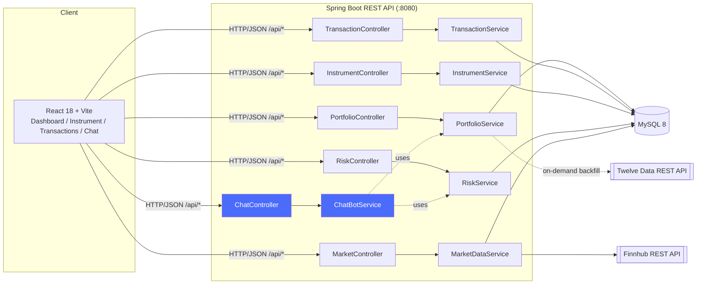

# Pixel — Portfolio Manager

[](https://github.com/Neueda-Learning/114_Pixel/actions/workflows/ci.yml)


A full-stack portfolio tracker: **Spring Boot 3.2.5 / Java 17** backend, **React
18 (Vite)** frontend, **MySQL 8** database. Track buy/sell transactions, see
derived holdings and performance, pull live quotes/profiles/news from Finnhub,
get transparent rule-based risk metrics with a BUY/HOLD/AVOID recommendation,
and query the portfolio in plain English through a deterministic, fully-Java
chat assistant — no external LLM or paid AI API required.

> **Educational project** — nothing in this application is financial advice.
> All recommendations and risk scores are derived from simple, transparent,
> auditable statistical rules over historical price data.

## Table of Contents

- [Key Features](#key-features)
- [Architecture](#architecture)
- [AI / Chat Assistant](#ai--chat-assistant)
- [Tech Stack](#tech-stack)
- [Release](#release)
- [Quickstart](#quickstart)
- [Environment Variables](#environment-variables)
- [Loading Real Historical Data](#loading-real-historical-data-kaggle-csvs)
- [Development](#development)
- [Testing](#testing)
- [Project Structure](#project-structure)
- [Further Documentation](#further-documentation)
- [Disclaimer](#disclaimer)

## Key Features

| Area | Capability |
|------|-----------|
| **Portfolio tracking** | Buy/sell transaction ledger; holdings, market value, and gain/loss are always *derived*, never stored, so they can never drift out of sync. |
| **Market data** | Live quotes, company profiles, and news proxied from Finnhub with server-side caching and automatic DB fallback if the API is unavailable or unconfigured. |
| **Risk engine** | Annualised volatility, Sharpe ratio, max drawdown, beta vs. SPY, SMA50/SMA200 trend, RSI-14, and a rule-based BUY/HOLD/AVOID recommendation with a plain-English rationale. |
| **Historical data backfill** | Per-symbol daily OHLCV history loaded from CSV seed files or backfilled on demand from the Twelve Data API — scoped to symbols actually held, not a fixed demo list. |
| **AI chat assistant** | Natural-language portfolio Q&A ("What's my best performer?", "Should I rebalance?", "What's the risk on AAPL?") answered deterministically from live portfolio/risk data — see [AI / Chat Assistant](#ai--chat-assistant). |
| **CSV import** | Bulk-import historical transactions from a CSV file via the Transactions UI. |
| **Responsive UI** | Dashboard, instrument detail, and transactions pages; collapsible mobile nav, live scrolling ticker, allocation donut, and performance charts. |

## Architecture



- **Holdings are derived, not stored** — computed on every request from the
  `transaction` ledger using the average-cost method (`PortfolioService`).
- **Historical prices** (charts, risk metrics) come from the `price_history`
  table: bulk-loaded from CSVs in `infra/db/seed/` at startup, and backfilled
  on demand from the Twelve Data API for any symbol actually held that isn't
  already seeded.
- **Live quote, company profile, and news** are proxied through the backend
  from Finnhub's free REST API (the API key never reaches the browser) and
  cached server-side (Caffeine) to stay under Finnhub's rate limits, with
  graceful fallback to `price_history` / `instrument` if Finnhub is
  unavailable.
- **The chat assistant is a thin NLP layer over the same services** the REST
  API already exposes — it introduces no new data path, external dependency,
  or non-determinism.

Full component diagram, sequence diagrams, and design rationale:
[docs/ARCHITECTURE.md](docs/ARCHITECTURE.md). Full endpoint reference:
[docs/API.md](docs/API.md).

## AI / Chat Assistant

`POST /api/chat` (backend: `ChatController` → `ChatBotService`; frontend:
`ChatPanel`) lets a user ask plain-English questions about their own
portfolio and get an answer grounded entirely in real, live data — no
hallucination risk, no external AI API key, no network egress, no cost per
query.

**How it works:** the message is lower-cased and matched against an ordered
set of keyword/regex intents (risk check, best/worst performer, allocation
and rebalancing, holdings list, performance over a period, portfolio
summary). The matched intent calls the *existing* `PortfolioService` /
`RiskService` methods used by the REST API and formats the real result into a
natural-language sentence. Symbol detection cross-checks tokens in the
message against the `instrument` table so "risk on aapl" resolves to `AAPL`.

**Example**

```
POST /api/chat
{ "message": "should I rebalance?" }

200 OK
{
  "reply": "Current allocation by asset type:\n- ETF: 33.7% ($5,200.00)\n- STOCK: 66.3% ($10,220.00)\nNo single asset type exceeds 40% of your portfolio — diversification looks healthy."
}
```

**Why rule-based instead of an LLM:** this app's portfolio data is
structured (three MySQL tables), not a document corpus, so retrieval-augmented
generation (RAG) is the wrong pattern here. A deterministic intent matcher
over the same service layer the REST API already uses gives 100% factual
accuracy, zero latency/cost, and no external attack surface — while fully
satisfying the "natural language queries" and "chatbot interface" goals of
the project's AI-integration brief. See
[docs/ARCHITECTURE.md#chat-assistant](docs/ARCHITECTURE.md#chat-assistant--ai-integration)
for the full design rationale and the upgrade path to an LLM-backed version
(LangChain4j + tool-calling) if broader natural-language coverage is needed
later.

## Tech Stack

| Layer | Technology |
|-------|-----------|
| Backend | Java 17, Spring Boot 3.2.5 (Web, Data JPA, Validation, Actuator, Cache) |
| Database | MySQL 8 |
| Caching | Caffeine (in-memory, TTL-based) |
| API docs | SpringDoc OpenAPI / Swagger UI |
| Frontend | React 18, React Router 7, Vite 5, Axios, Recharts |
| Market data | Finnhub (quotes/profile/news/search), Twelve Data (historical OHLCV backfill) |
| Containerization | Docker, Docker Compose |
| CI | GitHub Actions (`.github/workflows/ci.yml`) — backend `mvn test`, frontend `npm run build`, sanity Docker builds |

## Release

**v1.0.0** — 2026-08-05. All planned features are complete and the application is
production-ready. See [KANBAN.md](KANBAN.md) for the full feature history.

## Feature status

- ✅ **Foundation & Infra** — MySQL schema, entities, repositories, `HistoricalDataLoader`, CORS, docker-compose, Dockerfiles, CI.
- ✅ **Market Data** — Finnhub proxy (quote, profile, news, search), Caffeine cache, graceful DB fallback.
- ✅ **Risk Engine** — Annualised volatility, Sharpe ratio, max drawdown, beta, SMA50/SMA200 trend, RSI-14, BUY/HOLD/AVOID recommendation.
- ✅ **Portfolio domain** — Transaction ledger (with lot tracking, CSV import, editing), average-cost holdings derivation, summary, performance history.
- ✅ **AI Chat Assistant** — Rule-based natural-language portfolio Q&A (`ChatController` / `ChatBotService` / `ChatPanel`).
- ✅ **Frontend** — Dashboard, instrument detail, transactions UI, chat panel, responsive layout.
- ✅ **API docs** — Swagger UI (`/swagger-ui.html`), `docs/API.md`, `docs/ARCHITECTURE.md`.

## Quickstart

```bash
cp .env.example .env
# edit .env and set FINNHUB_API_KEY (free key at https://finnhub.io) and
# TWELVEDATA_API_KEY (free key at https://twelvedata.com) for chart data
docker compose up --build
```

| Service  | URL                                    |
|----------|-----------------------------------------|
| Frontend | http://localhost:5173                   |
| Backend  | http://localhost:8080                   |
| Swagger  | http://localhost:8080/swagger-ui.html   |
| MySQL    | localhost:3306                          |

On startup, `HistoricalDataLoader` seeds `price_history` from any CSVs in
`infra/db/seed/`, then derives the list of symbols actually held from the
`transaction` table and backfills daily OHLCV history for any of those
symbols not already covered from the Twelve Data API (`TWELVEDATA_API_KEY`
required — see [Loading real historical data](#loading-real-historical-data-kaggle-csvs)).
There is no synthetic/fake price data or hardcoded demo symbol list — every
chart is either real seed data or a real Twelve Data pull.

## Environment variables

Set in `.env` (see `.env.example`):

| Variable                     | Default                          | Purpose                                          |
|-------------------------------|-----------------------------------|---------------------------------------------------|
| `MYSQL_DATABASE`               | `portfolio`                      | Database name                                       |
| `MYSQL_USER`                   | `portfolio`                      | Database user                                       |
| `MYSQL_PASSWORD`               | —                                 | Database password                                   |
| `MYSQL_ROOT_PASSWORD`          | —                                 | Database root password                              |
| `SPRING_DATASOURCE_URL`        | `jdbc:mysql://db:3306/portfolio`| JDBC URL (backend)                                  |
| `SPRING_DATASOURCE_USERNAME`   | `portfolio`                      | DB user (backend)                                   |
| `SPRING_DATASOURCE_PASSWORD`   | —                                 | DB password (backend)                               |
| `FINNHUB_API_KEY`              | *(empty)*                        | Finnhub API key — market endpoints degrade to DB fallback / empty results if unset |
| `TWELVEDATA_API_KEY`           | *(empty)*                        | Twelve Data API key — required for price-history charts on symbols not covered by seed CSVs |
| `CORS_ALLOWED_ORIGINS`         | `http://localhost:5173`          | Comma-separated origins allowed to call the API     |
| `SEED_DIR`                     | `/app/seed` (docker) / `../infra/db/seed` (local) | Where the historical data loader looks for CSVs |

## Loading real historical data (Kaggle CSVs)

Drop daily-price CSVs into `infra/db/seed/`, one file per symbol, named
`<SYMBOL>.csv` (e.g. `AAPL.csv`). Expected columns (case-insensitive,
spaces/underscores ignored): `Date, Open, High, Low, Close, Adj Close, Volume`.

On the next `docker compose up`, `HistoricalDataLoader` picks up any CSV whose
symbol isn't already loaded and inserts its rows into `price_history`
(idempotent — rerunning won't duplicate data). It also upserts a matching
`instrument` row; well-known symbols get a real name/asset-type, anything else
defaults to `STOCK` (or `ETF` for a short list of common index ETFs).

To fully reload historical data from scratch, clear `price_history` and
`instrument` first:

```sql
TRUNCATE price_history, instrument;
```

then restart the backend with your CSVs in place.

## Development

**Backend** (Java 17, Maven):
```bash
cd backend
mvn test
mvn spring-boot:run
```

**Frontend** (Node 20, Vite):
```bash
cd frontend
npm install
npm run dev        # http://localhost:5173, proxies /api to localhost:8080
```

## Testing

```bash
cd backend && mvn test       # unit tests: PortfolioService, ChatBotService
cd frontend && npm run build # production build sanity check
```

CI (`.github/workflows/ci.yml`) runs both on every push/PR to `main`, plus a
sanity Docker build of both images.

## Project Structure

```
backend/    Spring Boot 3.2.5 / Java 17 REST API — see backend/README.md
frontend/   React 18 + Vite SPA — see frontend/README.md
docs/       API.md (endpoint reference), ARCHITECTURE.md (design + diagrams)
infra/db/   Schema (01_schema.sql) and CSV seed data
docker-compose.yml   Wires db + backend + frontend for local/dev use
KANBAN.md   Full shipped-feature history and backlog
```

## Further Documentation

| Document | Contents |
|----------|----------|
| [docs/ARCHITECTURE.md](docs/ARCHITECTURE.md) | Component diagram, sequence diagrams for portfolio/risk/chat data flows, DB schema, caching strategy, CI/CD, design decisions |
| [docs/API.md](docs/API.md) | Full REST endpoint reference with request/response examples |
| [backend/README.md](backend/README.md) | Backend package structure, local setup, configuration reference |
| [frontend/README.md](frontend/README.md) | Frontend stack, feature summary, dev commands |
| [KANBAN.md](KANBAN.md) | Shipped feature history by epic, with commits, and the backlog |

## Disclaimer

Risk metrics and recommendations (including the chat assistant's answers) are
rule-based and computed from historical prices only. Educational use only —
not financial advice.