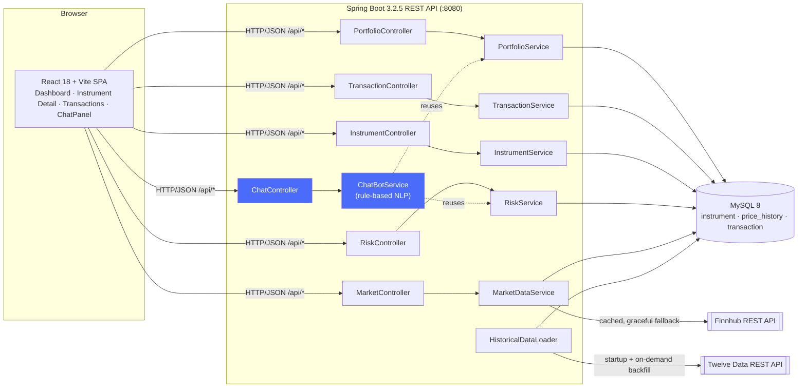
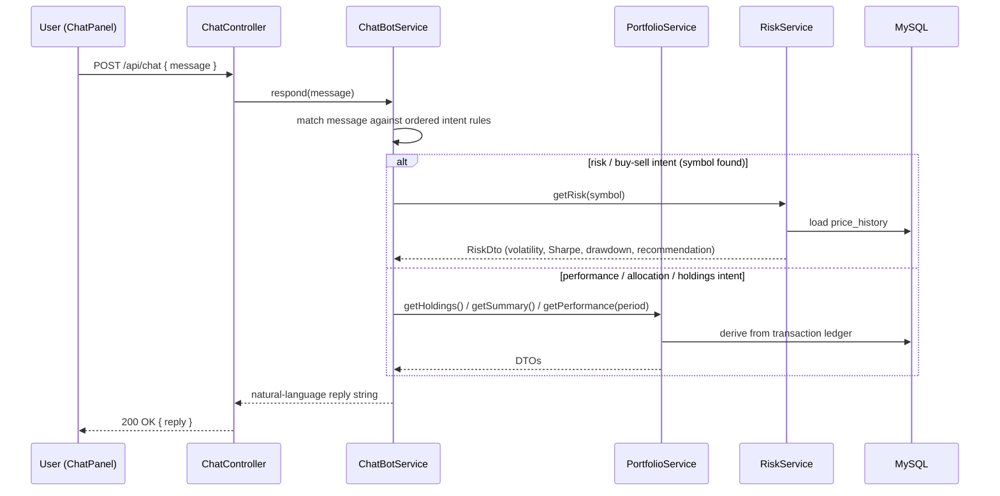

# Architecture — Pixel Portfolio Manager

## Table of Contents

- [System Overview](#system-overview)
- [Layers](#layers)
- [Data Flow — Portfolio Value](#data-flow--portfolio-value)
- [Data Flow — Risk Metrics](#data-flow--risk-metrics)
- [Chat Assistant / AI Integration](#chat-assistant--ai-integration)
- [Historical Data Seed](#historical-data-seed)
- [Caching Strategy](#caching-strategy)
- [CI / CD](#ci--cd)

## System Overview



## Layers

### React Frontend (`frontend/`)
- Single-page application built with Vite + React 18 + React Router 7.
- All API calls go through `src/api/` modules (Axios); never fetches Finnhub directly.
- `useApi` hook provides `{ data, loading, error, reload }` for every data-fetching component.
- Recharts powers all charts (time-series performance, allocation donut).
- Nginx serves the production build and proxies `/api/*` to the backend container.

### Spring Boot Backend (`backend/`)
- Stateless REST API; every response is a DTO — JPA entities never escape the service layer.
- Controllers delegate entirely to services; no business logic in controllers.
- `GlobalExceptionHandler` maps domain exceptions to consistent JSON error responses.
- `ChatController` / `ChatBotService` are a thin NLP layer over `PortfolioService` and
  `RiskService` — they introduce no new data path, external API, or non-determinism (see
  [Chat Assistant / AI Integration](#chat-assistant--ai-integration) below).

### Database (MySQL 8)
Three tables:

| Table | Purpose |
|-------|---------|
| `instrument` | Reference data — symbol, name, asset type |
| `price_history` | Daily OHLCV rows per symbol (composite PK: symbol + trade_date) |
| `transaction` | Buy/sell ledger — source of truth for all holdings math |

There is **no holdings table**. Holdings are derived on every request from the transaction
ledger using the average-cost method in `PortfolioService`.

### Finnhub Integration
`FinnhubMarketDataService` implements `MarketDataService` and calls:
- `/quote/{symbol}` → live price, change, % change
- `/stock/profile2?symbol=` → company profile (name, sector, market cap, logo)
- `/company-news` → recent headlines
- `/search` → symbol lookup

All responses are cached server-side with Caffeine (configured in `CacheConfig`).
If Finnhub is unavailable or `FINNHUB_API_KEY` is unset, every method falls back to
the `price_history` / `instrument` tables — the app never fails hard on a missing key.

## Data Flow — Portfolio Value

```
User adds BUY transaction
        │
        ▼
transaction table (ledger)
        │
        ▼ (on GET /api/portfolio)
PortfolioService.getHoldings()
  ├── groups transactions by symbol
  ├── computes qty + avg cost via average-cost method
  ├── calls MarketDataService.getQuote(symbol) for live price
  │       └── falls back to MAX(trade_date) from price_history if Finnhub fails
  └── returns HoldingDto list with market value, gain/loss, gain/loss %
```

## Data Flow — Risk Metrics

```
GET /api/risk/{symbol}
        │
        ▼
RiskService.getRisk(symbol)
  ├── loads ~1 year of daily closes from price_history
  ├── computes daily log returns
  ├── RiskMath.annualisedVolatility()   — σ × √252
  ├── RiskMath.sharpeRatio()            — (mean return − rf) / σ   (rf = 0 for simplicity)
  ├── RiskMath.maxDrawdown()            — peak-to-trough % decline
  ├── RiskMath.beta()                   — covariance(stock, SPY) / variance(SPY)
  └── recommendation: BUY / HOLD / AVOID based on rule thresholds
```

## Chat Assistant / AI Integration

`ChatController` (`POST /api/chat`) → `ChatBotService` is a **deterministic, rule-based
natural-language layer**, not an LLM or RAG pipeline. It exists to satisfy the project's
"natural language queries" / "chatbot interface" AI-integration goals without introducing
an external API dependency, cost per query, or hallucination risk.



**Design rationale — why rule-based, not RAG or an LLM API:**

| Consideration | Rule-based (chosen) | RAG | Raw LLM API |
|---|---|---|---|
| Data shape | Structured (3 SQL tables) — ideal fit | Built for unstructured document corpora — no document corpus exists here | Needs the same structured-data problem solved regardless |
| Accuracy | 100% — every answer traces to a real service call | Retrieval quality-dependent | Prone to hallucinating figures |
| Cost / latency | None — pure Java, in-process | Embedding + vector DB + LLM call | Per-token API cost + network round trip |
| External attack surface | None | Prompt injection via retrieved docs | Prompt injection via user input |
| Dependencies | Zero new deps | Vector store + embedding model | API key management, egress |

RAG is the wrong pattern here because there is no unstructured document collection to
retrieve from — the "knowledge base" is three relational tables already served by a REST
API. A deterministic intent matcher over that same service layer is the natural, minimal
solution.

**Upgrade path (if broader NL coverage is needed later):** replace the keyword-matching
core of `ChatBotService` with an LLM using **tool/function calling** (e.g. LangChain4j,
which — unlike Spring AI — does not require Spring Boot 3.3+) where the model selects
which of `PortfolioService`/`RiskService`'s existing methods to invoke and narrates the
result. This keeps the same "answers grounded in real service data" guarantee while
widening the range of phrasings understood. True RAG only becomes justified if financial
news sentiment analysis (embedding and retrieving news articles) is added as a feature.

## Historical Data Seed

`HistoricalDataLoader` (runs once at startup via `CommandLineRunner`, and again on demand
whenever a new symbol is traded):
1. Scans `SEED_DIR` for `<SYMBOL>.csv` files and bulk-inserts any not already loaded into
   `price_history` (idempotent).
2. Derives the list of symbols actually held from the `transaction` table
   (`TransactionRepository.findDistinctSymbols()`) — **no hardcoded demo symbol list**.
3. For any of those symbols still missing `price_history` rows, fetches real daily OHLCV
   data from the [Twelve Data](https://twelvedata.com/) API (`TwelveDataHistoricalService`)
   and persists it, so each symbol is fetched only once.

There is no synthetic or randomly generated price data anywhere in the application — every
chart is either real seed data or a real Twelve Data pull.

## Caching Strategy

| Cache name | TTL | What it stores |
|-----------|-----|---------------|
| `quotes` | 5 min | Finnhub live quote per symbol |
| `profiles` | 1 hour | Finnhub company profile per symbol |
| `news` | 15 min | Finnhub news list per symbol |

## CI / CD

GitHub Actions (`.github/workflows/`) runs on every push:
- Backend: `mvn test` (Java 17)
- Frontend: `npm ci && npm run build` (Node 20)

Docker images are built with multi-stage `Dockerfile`s in `backend/` and `frontend/`.
`docker-compose.yml` at the repo root wires all three services (db, backend, frontend).

